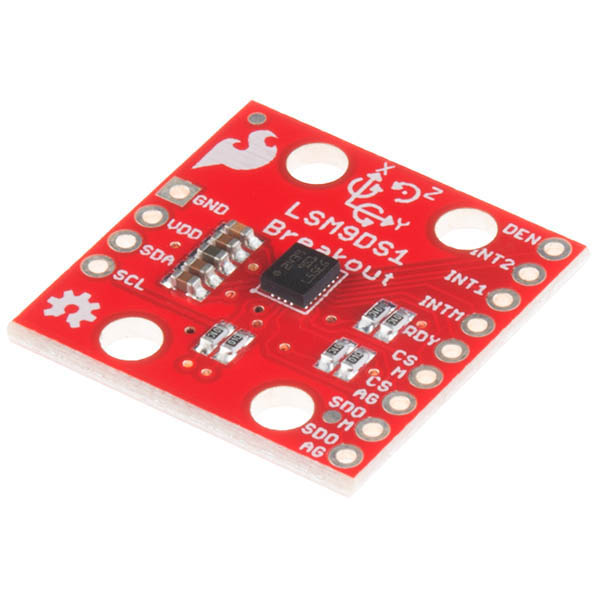

<!-- link list, last updated 15.01.2023 -->
[0]: https://www.sparkfun.com/products/retired/13284
[1]: https://compsci290-s2016.github.io/CoursePage/Materials/EulerAnglesViz/
[2]: https://www.youtube.com/watch?v=whSw42XddsU

# IMU

An IMU (Inertial Measurement Unit) sensor is a compact electronic device that measures and reports motion-related data. It typically consists of gyroscopes, accelerometers, and sometimes magnetometers. Gyroscopes measure angular velocity, accelerometers measure linear acceleration, and magnetometers detect magnetic fields. IMU sensors are commonly used in robotics, drones, wearable devices, and motion-capture systems to track orientation, velocity, and gravitational forces. They provide essential data for navigation, stabilization, and motion analysis in various applications.

<p align="center">
     </br>
    <i>IMU breakout board</i>
</p>

## Technical Specifications

| | LSM9DS1 IMU sensor|
|-|-|
|Channels           | 3 acceleration, 3 angular rate, 3 magnetic field|
|Data output        | 16 bit                                          |
|Interface          | SPI/I2C                                         |
|Supply voltage     | 1.9 V to 3.6V                                   |
|Linear acceleration| ±2/±4/±8/±16 g                                  |
|Gauss magnetic     | ±4/±8/±12/±16                                   | 
|Dps angular rate   | ±245/±500/±2000                                 |

## Links

[SparkFun 9DoF IMU Breakout - LSM9DS1][0] <br>

## Datasheets 

[LSM9DS1](../datasheets/lsm9ds1.pdf)

## Principle of Operation
IMU with 9 degrees of freedom is a device that electronically measures and provides information about a body's specific force, how fast it's rotating, and sometimes its orientation. It does this by using a mix of accelerometers, gyroscopes, and magnetometers.
- Accelerometer - it detects acceleration or changes in velocity along the three axes of 3D space. Sensor operates by employing a small mass connected to fixed capacitors arranged using MEMS technology. When the sensor experiences acceleration or velocity changes in a specific direction, the mass inside the accelerometer moves relative to the fixed capacitors. This alters the distance between the mass and capacitors, thereby changing the capacitance of the system. An electronic circuit detects this capacitance change and converts it into a digital signal. </br>
- Gyrometer - is a sensor designed to gauge the rate of rotation or angular velocity of an object across the three axes of 3D space.Functioning through a minute vibrating component, often a MEMS resonator, it oscillates within a specific frequency range. As the gyro undergoes angular motion, the Coriolis force impacts the resonator, a process detected by sensors positioned around it. These sensors ascertain the rate and direction of angular motion, which is then translated into a digital signal by an electronic circuit. </br>
- Magnetometer - is a sensor crafted to gauge the intensity of the magnetic field surrounding it across the three axes of 3D space. Its mechanism involves a MEMS (Micro-Electro-Mechanical Systems) device housing a minuscule silicon structure designed to respond to magnetic fields.When the sensor encounters a magnetic field, the silicon structure undergoes movement, detected by capacitive or resistive elements within the MEMS device. This alteration in capacitance/resistance is then detected by an electronic circuit, which transforms it into a digital signal. </br>

### Sensors fusion
-------------------
To achieve optimal data accuracy, sensor fusion employs specialized algorithms to integrate measurements from multiple sensors of varying types. By merging the strengths of different sensors, this process capitalizes on their respective favorable characteristics, culminating in the attainment of the most precise measurements possible.

A good example to understand the idea of sensor fusion is the measurement of roll angle using an accelerometer and a gyrometer. As written above, the accelerometer measures the acceleration in each of the three axes and the gyrometer determines the rotational speed around the three axes.
The measurements from the gyrometer and the measurements from the accelerometer can be used separately to estimate the roll angle. However, such an estimation will not be accurate due to the disadvantages of the single sensor measurement rules. The gyrometer is an accurate sensor in the short term, because in the long term, there is an accumulation of error which ultimately leads to an incorrect angle determination. The accelerometer, on the other hand, is a useful tool in the long term, as it measures the acceleration of the earth, which is constant and in a constant direction. It should be remembered that it also measures the acceleration of the object to which it is attached, so in the case of random movement of an object, distortions appear, causing an error in determining the angle. 

Therefore, the two sensors are fused, which combines the precise operation of the gyroscope in the short term and the accelerometer in the long term. This fusion is made with the help of different filters, the simplest of which is a complementary filter, which uses a low pass filter for measurements from an accelerometer and a high pass filter for measurements from a gyrometer, then by manipulating the coefficient you can change the confidence ratio to a particular sensor, remembering that the sum of the confidence factors is always 1.

<p align="center">
     </br>
    <i>Complementary filter</i>
</p>

The link to the video, which explains the principle of fusion of these two sensors in a very accurate and accessible way, can be found [here][2]

The ``IMU`` class is using Mahony filter, which is an improved variant of Madgwick filter to accurately estimate orientation in space by combining data from accelerometer and gyroscope sensors. The Mahony filter can also integrate magnetometer data to further refine orientation estimation by providing a reference to the Earth's magnetic field. This allows for absolute orientation determination relative to magnetic north, enhancing the overall accuracy of the orientation estimation process.

### Magnetometer
------------------------
In order to improve the accuracy of position determination and to enable determination of yaw, a magnetometer is used. This sensor measures the strength and direction of a magnetic field and in the context of sensor fusion plays a crucial role in providing a reference to the Earth's magnetic field, aiding in orientation estimation alongside accelerometers and gyroscopes.

However, integrating magnetometer data into sensor fusion algorithms presents several challenges, primarily stemming from the need for accurate calibration. Magnetometers are highly sensitive instruments that can be influenced by various sources of magnetic interference, including nearby metallic objects, electrical equipment, and even the Earth's own magnetic anomalies. These external factors can distort the measured magnetic field, leading to inaccuracies in orientation estimation.

**NOTE:**
- IMU by default is not using magnetometer for position evaluation, to enable it is necessary to change defined variable to true in ``IMU.h`` file:
```
#define IMU_THREAD_DO_USE_MAG_FOR_MAHONY_UPDATE true
```
- Matlab file that is used to help with magnetometer calibration can be found [here](../dev/dev_imu/99_fcn_bib/MgnCalibration.m)

## Practical Tips
- Typically, the IMU on the PES Board should be mounted in such a way that the coordinate system is arranged as shown in the following illustration. However, it should be remembered that it may be in a different position on the board, so you should be sure of the direction of the axes in the coordinate system before continuing to use the data, and the most convenient way to do this is to print the acceleration indications into the console and then set the board in three positions and think about the position of the coordinate system.
<p align="center">
     </br>
    <i>IMU coordinate system</i>
</p>

## IMU Driver
The ``IMU`` class is a tool used to process the results through the fusion of three sensors included in the IMU and calculations used to obtain information about the position of the board in space, as well as about the movement of the board.
The following data can be obtained directly from the driver:
- gyroscope - values in three XYZ axes;
- accelerometer - values in three XYZ axes;
- magnetometer - values in three XYZ axes;
- board orientation expressed in quaterions obtained by means of the fusion of sesors with the use of a Mahony filter;
- board orientation expressed in Euler angles in the Roll Pitch Yaw convention [visualization][1];
- tilt angle;

To start working with the IMU, it is necessary to create an object in the ***main.cpp*** file and assign the correct pins. </br>
There is no need to plug anything as IMU is an integral part of the PES Board. Pins that are used to communicate with the IMU:
```
// IMU
#define PB_IMU_SDA PC_9
#define PB_IMU_SCL PA_8
```

### Create IMU Object
--------------------------------------
Add the IMU driver ``IMU.h`` to the top of the ***main.cpp*** file:

```
#include "pm2_drivers/IMU.h"
```

To be able to start to use the ``IMU`` driver, the initial step is to create the IMU object and specify the pins to which the hardware is connected in the ``main()`` scope.

As mentioned the IMU is using two pins to communicate. Next step is to create an object of the class that will serve as a store of data, sorted in an appropriate way and second object with the associated pins passed as an argument to receive measurments from IMU:

```
ImuData imu_data;
IMU imu(PB_IMU_SDA, PB_IMU_SCL); 
```

`ImuData` is a data structure that is updated as the IMU class thread runs, so an object has been created above to collect and access this data. Use the following commands to access the data, bearing in mind that axis-dependent data should be indexed as follows:
- X -> 0
- Y -> 1
- Z -> 2

```
// acceleration around three axis
float acc_X_axis = imu_data.acc(0);
float acc_Y_axis = imu_data.acc(1); 
float acc_Z_axis = imu_data.acc(2);
```

<!-- Below is an example of the use of the IMU to build a gimbal, allowing image stabilisation in two axes -->